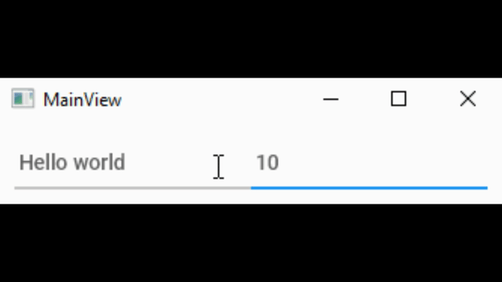

[](https://GitHub.com/Naereen/StrapDown.js/graphs/commit-activity)
[](https://github.com/Naereen/StrapDown.js/blob/master/LICENSE)
[](http://makeapullrequest.com)
[](https://github.com/Naereen/badges/)
[](https://github.com/Naereen/badges)

# TornadoFX starter app


Sample TornadoFX starter app with enabled coroutines.

I use this template to start my apps.  

## How to run

```bash
    gradlew run
```




## What is TornadoFX?

When you have to develop a desktop applications and don't want to use Swing or JavaFX. But something better.
 It's something like SwiftUI - but in kotlin. 
 
 more info here
 
 - Official GitHub https://github.com/edvin/tornadofx
 - I recommend to check out https://github.com/thomasnield - Mostly AI stuff in Kotlin and TornadoFX
  
  


## How to contribute

Create a pull request! I'm more than happy to see your suggestions. 

---
Inspired by @mikegreat - who showed me TornadoFX and taught a lot about Kotlin.  

